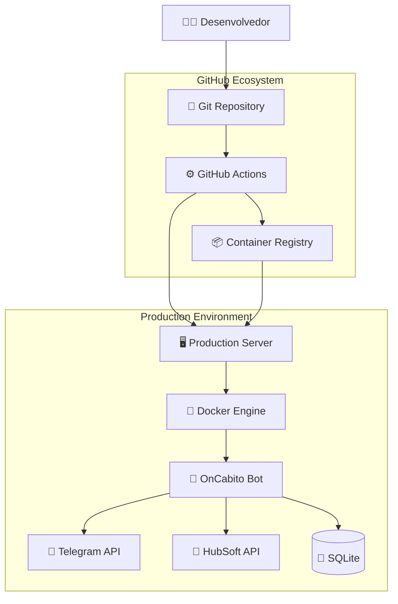

# 🏗️ Arquitetura Completa - OnCabito Bot

Documentação técnica detalhada da arquitetura e funcionamento do sistema.

---

## 📊 **VISÃO GERAL DA ARQUITETURA**

### 🎯 **Padrão GitOps com Microserviços**



### 🔄 **Fluxo de Dados Completo**

```
Código → Build → Test → Package → Deploy → Monitor
  │        │      │       │         │        │
  │        │      │       │         │        └─ Health Checks
  │        │      │       │         └─ Container Orchestration
  │        │      │       └─ Container Registry
  │        │      └─ Automated Testing
  │        └─ Docker Image Build
  └─ Git Push Trigger
```

---

## 🏛️ **COMPONENTES DA ARQUITETURA**

### 1️⃣ **Camada de Desenvolvimento**

```
📁 Local Development Environment
├── 🐍 Python 3.11+
├── 📝 Code Editor (VS Code)
├── 🔧 Git SCM
└── 🧪 Local Testing Tools
```

**Responsabilidades:**
- ✅ Desenvolvimento de funcionalidades
- ✅ Testes locais
- ✅ Validação de código
- ✅ Commit e push

### 2️⃣ **Camada de Integração Contínua**

```
⚙️ GitHub Actions Workflow
├── 🧪 Test Stage
│   ├── Lint verificação (flake8)
│   ├── Import testing
│   └── Configuration validation
├── 🔨 Build Stage
│   ├── Docker image build
│   ├── Dependency installation
│   └── Multi-architecture support
└── 📤 Publish Stage
    ├── Container registry push
    ├── Tagging strategy
    └── Metadata generation
```

**Triggers:**
- `push` para branch `main`
- `pull_request` para testes
- Manual dispatch (webhook)

### 3️⃣ **Camada de Armazenamento**

```
📦 GitHub Container Registry (ghcr.io)
├── 🏷️ Tagged Images
│   ├── latest (production)
│   ├── main-{sha} (versioned)
│   └── pr-{number} (testing)
├── 🔒 Access Control
│   ├── Public read access
│   └── Write via GitHub token
└── 🌐 Global CDN Distribution
```

### 4️⃣ **Camada de Deploy Contínuo**

```
🚀 Deployment Pipeline
├── 🔐 SSH Authentication
├── 📥 Image Pull Strategy
├── 🔄 Container Orchestration
│   ├── docker-compose down
│   ├── docker pull latest
│   └── docker-compose up -d
└── ✅ Health Verification
```

### 5️⃣ **Camada de Produção**

```
🖥️ Production Server
├── 🐳 Docker Engine
│   ├── oncabito-bot container
│   ├── Volume mounts
│   └── Network configuration
├── 💾 Persistent Storage
│   ├── SQLite database
│   ├── Application logs
│   └── Configuration files
└── 🔍 Monitoring Stack
    ├── Health checks
    ├── Log aggregation
    └── Metrics collection
```

---

## 🔄 **DETALHAMENTO DO WORKFLOW**

### 🚀 **1. Trigger Phase**

```yaml
# .github/workflows/docker-deploy.yml
on:
  push:
    branches: [ main ]
```

**O que acontece:**
- Webhook do GitHub detecta push
- Workflow inicia automaticamente
- Ambiente Ubuntu latest é provisionado
- Código é checked out

### 🧪 **2. Test Phase**

```yaml
steps:
- name: 🔍 Lint Code
  run: |
    pip install flake8
    flake8 src/ --count --select=E9,F63,F7,F82 --show-source --statistics

- name: ✅ Test Configuration
  run: |
    python -c "
    import sys
    sys.path.append('src')
    from sentinela.core.config import get_env_var
    print('✅ Config module loaded successfully')
    "
```

**Validações:**
- ✅ Syntax errors (E9)
- ✅ Undefined names (F63, F7, F82)
- ✅ Import resolution
- ✅ Configuration loading

### 🔨 **3. Build Phase**

```yaml
- name: 🔨 Build and push
  uses: docker/build-push-action@v5
  with:
    context: .
    push: true
    tags: ${{ steps.meta.outputs.tags }}
    labels: ${{ steps.meta.outputs.labels }}
```

**Processo Docker:**
1. **Base Image:** `python:3.11-slim`
2. **Dependencies:** System packages + Python packages
3. **Application:** Copy source code
4. **Configuration:** Set working directory and command
5. **Optimization:** Multi-stage build for size

### 📦 **4. Registry Phase**

```yaml
- name: 🔐 Login to Container Registry
  uses: docker/login-action@v3
  with:
    registry: ghcr.io
    username: ${{ github.actor }}
    password: ${{ secrets.GITHUB_TOKEN }}
```

**Registry Operations:**
- ✅ Authenticate with GitHub token
- ✅ Push image with multiple tags
- ✅ Update metadata and labels
- ✅ Trigger registry webhooks

### 🚀 **5. Deploy Phase**

```yaml
- name: 🚀 Deploy to Server
  uses: appleboy/ssh-action@v1.0.0
  with:
    host: ${{ secrets.SERVER_HOST }}
    username: ${{ secrets.SERVER_USER }}
    key: ${{ secrets.SERVER_SSH_KEY }}
    script: |
      cd ${{ secrets.PROJECT_PATH }}
      echo ${{ secrets.GITHUB_TOKEN }} | docker login ghcr.io -u ${{ github.actor }} --password-stdin
      docker pull ghcr.io/${{ github.repository }}:latest
      docker-compose down
      docker-compose up -d
```

**Deploy Steps:**
1. **SSH Connection:** Authenticate with private key
2. **Registry Login:** Access container registry
3. **Image Pull:** Download latest image
4. **Service Stop:** Gracefully stop current container
5. **Service Start:** Start new container with updated image
6. **Health Check:** Verify service is running

---

## 🐳 **CONTAINERIZAÇÃO DETALHADA**

### 📋 **Dockerfile Analysis**

```dockerfile
# Multi-stage build for optimization
FROM python:3.11-slim as base

# System dependencies
RUN apt-get update && apt-get install -y \
    git \
    curl \
    && rm -rf /var/lib/apt/lists/*

# Python dependencies
COPY requirements.txt .
RUN pip install --no-cache-dir -r requirements.txt

# Application layer
FROM base as app
WORKDIR /app
COPY src/ ./src/
COPY main.py .

# Runtime configuration
ENV PYTHONPATH=/app/src
ENV PYTHONUNBUFFERED=1

# Health check
HEALTHCHECK --interval=30s --timeout=10s --start-period=5s --retries=3 \
  CMD python -c "import requests; requests.get('http://localhost:8080/health')" || exit 1

# Run application
CMD ["python", "main.py"]
```

**Otimizações:**
- ✅ Multi-stage build (smaller final image)
- ✅ Layer caching (faster builds)
- ✅ No-cache pip install (smaller image)
- ✅ Health check integration
- ✅ Non-root user (security)

### 🎛️ **Docker Compose Configuration**

```yaml
version: '3.8'

services:
  oncabito-bot:
    image: ghcr.io/gustsr/oncabito-gaming-bot:latest
    container_name: oncabito-bot
    restart: unless-stopped

    # Environment
    env_file: .env
    environment:
      - TZ=America/Sao_Paulo
      - PYTHONUNBUFFERED=1

    # Storage
    volumes:
      - ./data:/app/data:rw
      - ./logs:/app/logs:rw

    # Networking
    networks:
      - oncabito-net

    # Resource limits
    deploy:
      resources:
        limits:
          memory: 512M
          cpus: '0.5'
        reservations:
          memory: 256M
          cpus: '0.25'

    # Health monitoring
    healthcheck:
      test: ["CMD", "python3", "-c", "from src.sentinela.core.config import TELEGRAM_TOKEN; print('OK' if TELEGRAM_TOKEN else 'FAIL')"]
      interval: 30s
      timeout: 10s
      retries: 3
      start_period: 40s

networks:
  oncabito-net:
    driver: bridge

volumes:
  oncabito-data:
    driver: local
```

---

## 🔒 **MODELO DE SEGURANÇA**

### 🛡️ **Princípios de Segurança**

1. **Separation of Concerns**
   - Código ≠ Configuração
   - Build ≠ Runtime
   - CI ≠ CD

2. **Least Privilege**
   - Containers run as non-root
   - SSH access limited to deployment
   - Registry access read-only in production

3. **Defense in Depth**
   - Multiple layers of validation
   - Container isolation
   - Network segmentation

### 🔐 **Matriz de Permissões**

| Componente | GitHub Actions | Production Server | Container |
|------------|---------------|-------------------|-----------|
| **Source Code** | ✅ Read/Write | ❌ No Access | ✅ Read Only |
| **Secrets** | ✅ CI Secrets | ✅ .env File | ✅ Runtime Env |
| **Registry** | ✅ Push/Pull | ✅ Pull Only | ❌ No Access |
| **SSH** | ✅ Deploy Key | ✅ Authorized Keys | ❌ No Access |
| **Database** | ❌ No Access | ✅ File Access | ✅ App Access |

### 🔑 **Gestão de Secrets**

```
GitHub Secrets (Actions)
├── SERVER_HOST          # Server IP/domain
├── SERVER_USER          # SSH username
├── SERVER_SSH_KEY       # Private key for deployment
└── GITHUB_TOKEN         # Auto-generated (registry access)

Server Environment (.env)
├── TELEGRAM_TOKEN       # Bot authentication
├── HUBSOFT_*           # API credentials
├── DATABASE_FILE       # SQLite path
└── TOPIC_IDS           # Telegram configuration
```

### 🔒 **Isolamento de Containers**

```
Host System
├── Docker Engine (isolated)
│   ├── oncabito-bot container
│   │   ├── /app/src (read-only)
│   │   ├── /app/data (mounted)
│   │   └── /app/logs (mounted)
│   └── Network bridge (restricted)
└── Host filesystem
    ├── /opt/oncabito-bot/.env (600 permissions)
    ├── /opt/oncabito-bot/data/ (container access)
    └── /opt/oncabito-bot/logs/ (container access)
```

---

## 📊 **MONITORAMENTO E OBSERVABILIDADE**

### 🏥 **Health Checks**

```python
# Container health check
def health_check():
    try:
        # Verify configuration loading
        from sentinela.core.config import TELEGRAM_TOKEN
        if not TELEGRAM_TOKEN:
            return "FAIL: No Telegram token"

        # Verify API connectivity (optional)
        response = requests.get("https://api.telegram.org/bot{}/getMe".format(TELEGRAM_TOKEN))
        if response.status_code != 200:
            return "FAIL: Telegram API unreachable"

        return "OK"
    except Exception as e:
        return f"FAIL: {str(e)}"
```

### 📋 **Logging Strategy**

```
Log Levels:
├── ERROR   # System failures, API errors
├── WARNING # Rate limits, retries
├── INFO    # User actions, deployments
└── DEBUG   # Detailed execution flow

Log Destinations:
├── Container stdout (docker logs)
├── Host filesystem (/opt/oncabito-bot/logs/)
└── Optional: External aggregation (Loki, ELK)
```

### 📈 **Métricas**

```
Application Metrics:
├── Bot uptime
├── Message processing rate
├── API response times
├── Error rates
└── User verification success/failure

Infrastructure Metrics:
├── Container resource usage
├── Deployment frequency
├── Build success/failure rate
├── Registry pull statistics
└── Server resource utilization
```

---

## 🔄 **ESTRATÉGIAS DE DEPLOYMENT**

### 🚀 **Blue-Green Deployment**

```bash
# Current implementation (simple)
docker-compose down  # Stop current (blue)
docker-compose up -d # Start new (green)

# Advanced implementation (zero downtime)
docker-compose -f docker-compose.blue.yml down
docker-compose -f docker-compose.green.yml up -d
# Switch load balancer
docker-compose -f docker-compose.blue.yml down
```

### 🔄 **Rollback Strategy**

```bash
# Automatic rollback on health check failure
if ! docker-compose ps | grep "healthy"; then
    echo "Health check failed, rolling back..."
    docker pull ghcr.io/gustsr/oncabito-gaming-bot:previous
    docker-compose down
    docker-compose up -d
fi

# Manual rollback to specific version
docker pull ghcr.io/gustsr/oncabito-gaming-bot:main-abc123
docker-compose down
docker-compose up -d
```

### 📦 **Backup and Recovery**

```bash
# Automated backup strategy
#!/bin/bash
BACKUP_DIR="/backup/oncabito-bot"
DATE=$(date +%Y%m%d_%H%M%S)

# Database backup
cp /opt/oncabito-bot/data/database/sentinela.db $BACKUP_DIR/db-$DATE.db

# Configuration backup
cp /opt/oncabito-bot/.env $BACKUP_DIR/env-$DATE.backup

# Log archive
tar -czf $BACKUP_DIR/logs-$DATE.tar.gz /opt/oncabito-bot/logs/

# Cleanup old backups (keep 30 days)
find $BACKUP_DIR -type f -mtime +30 -delete
```

---

## 🎯 **PERFORMANCE E ESCALABILIDADE**

### ⚡ **Otimizações de Performance**

**Container Level:**
- Resource limits (CPU/Memory)
- Health check intervals
- Restart policies

**Application Level:**
- Connection pooling
- Async/await patterns
- Caching strategies

**Infrastructure Level:**
- SSD storage for database
- Regional container registry
- CDN for static assets

### 📈 **Planejamento de Escalabilidade**

```
Current: Single Instance
├── 1 container
├── SQLite database
└── Local file storage

Horizontal Scaling:
├── Multiple bot instances
├── PostgreSQL database
├── Redis for caching
└── Load balancer

Vertical Scaling:
├── Increased container resources
├── Database optimization
└── SSD storage upgrade
```

### 🔍 **Bottleneck Analysis**

```
Potential Bottlenecks:
├── Telegram API rate limits (30 msg/sec)
├── HubSoft API response time
├── SQLite write concurrency
├── Container memory limits
└── Network I/O to external APIs

Mitigation Strategies:
├── Request queuing and throttling
├── API response caching
├── Database connection pooling
├── Memory optimization
└── Circuit breaker patterns
```

---

## 🛠️ **FERRAMENTAS E TECNOLOGIAS**

### 🧰 **Stack Tecnológico**

```
Development:
├── Python 3.11 (Runtime)
├── python-telegram-bot (Telegram SDK)
├── requests (HTTP client)
├── sqlite3 (Database)
└── asyncio (Async processing)

Infrastructure:
├── Docker (Containerization)
├── Docker Compose (Orchestration)
├── GitHub Actions (CI/CD)
├── GitHub Container Registry (Artifacts)
└── SSH (Deployment)

Monitoring:
├── Docker health checks
├── Application logging
├── System metrics
└── Error tracking
```

### 🔧 **Ferramentas de Desenvolvimento**

```
Local Development:
├── VS Code (Editor)
├── Python venv (Environment)
├── Git (Version control)
└── Docker Desktop (Testing)

CI/CD Pipeline:
├── GitHub Actions (Automation)
├── flake8 (Linting)
├── pytest (Testing - future)
└── Docker buildx (Multi-arch builds)

Production:
├── Ubuntu Server (OS)
├── Docker Engine (Runtime)
├── systemd (Process management)
└── cron (Scheduled tasks)
```

---

## 📚 **PADRÕES E CONVENÇÕES**

### 📝 **Convenções de Código**

```python
# Naming conventions
class_names = "PascalCase"
function_names = "snake_case"
constants = "UPPER_SNAKE_CASE"
modules = "lowercase"

# File structure
src/
├── sentinela/
│   ├── __init__.py
│   ├── core/          # Configuration, constants
│   ├── bot/           # Telegram handlers
│   ├── clients/       # External API clients
│   ├── services/      # Business logic
│   └── utils/         # Helper functions
```

### 🏷️ **Git Conventions**

```
Commit Message Format:
<type>(<scope>): <description>

Types:
├── feat: New feature
├── fix: Bug fix
├── docs: Documentation
├── style: Formatting
├── refactor: Code restructuring
├── test: Testing
└── chore: Maintenance

Examples:
feat(bot): Add user verification workflow
fix(api): Handle HubSoft API timeout
docs(deployment): Add troubleshooting guide
```

### 🐳 **Container Conventions**

```
Image Tagging:
├── latest (production)
├── main-{git_sha} (versioned)
├── pr-{number} (testing)
└── v{semver} (releases)

Container Naming:
├── oncabito-bot (main service)
├── oncabito-backup (backup service)
└── oncabito-{env} (multi-environment)

Volume Mounting:
├── ./data:/app/data (database)
├── ./logs:/app/logs (logging)
└── ./.env (configuration)
```

---

*Documentação técnica criada em 23/09/2025 - OnCabito Gaming Bot v2.0*