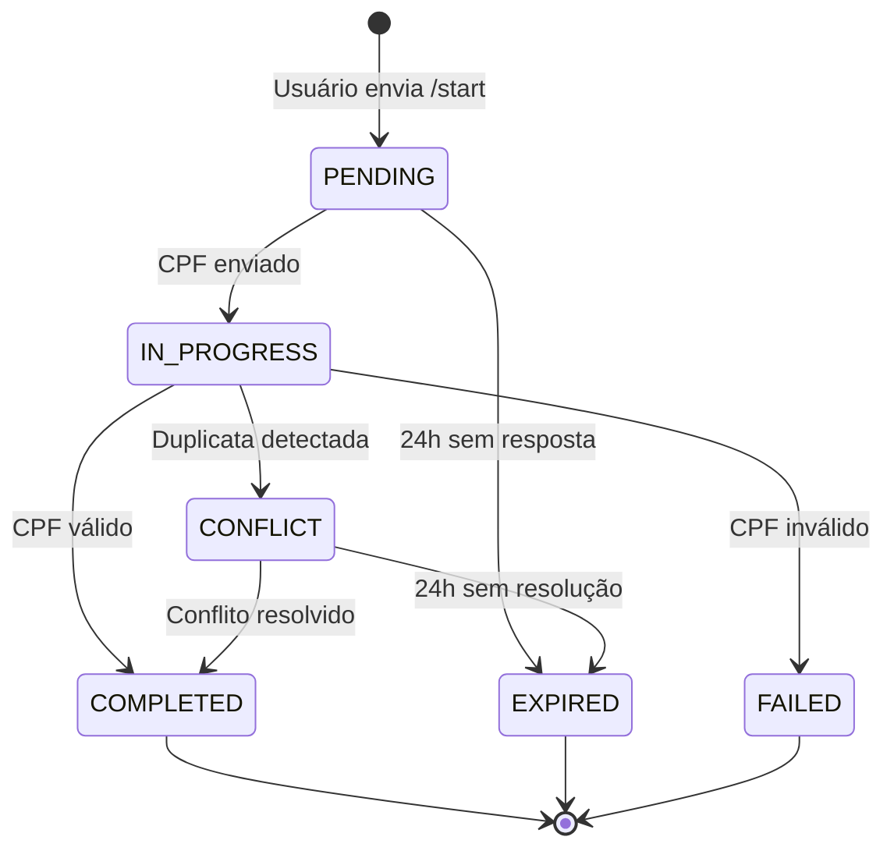

# 💡 MELHORIAS RECOMENDADAS - Sentinela Bot

> **Data da Análise**: 16 de Outubro de 2024
> **Versão**: 1.0
> **Status**: Pendente de Implementação

---

## 📋 Índice

1. [Visão Geral](#visão-geral)
2. [Melhorias Prioritárias](#melhorias-prioritárias)
3. [Melhorias de Médio Prazo](#melhorias-de-médio-prazo)
4. [Melhorias de Longo Prazo](#melhorias-de-longo-prazo)
5. [Referências e Recursos](#referências-e-recursos)

---

## 🎯 Visão Geral

Este documento consolida **melhorias não críticas** identificadas durante a análise profunda do código do Sentinela Bot. Estas melhorias **não são bugs**, mas sim oportunidades de tornar o sistema mais robusto, legível e manutenível.

### Critérios de Priorização

| Prioridade | Critério |
|------------|----------|
| 🔴 **Alta** | Previne bugs futuros, melhora significativamente a experiência do desenvolvedor |
| 🟡 **Média** | Melhora observabilidade e facilita debugging |
| 🟢 **Baixa** | Nice to have, benefícios a longo prazo |

---

## 🔴 Melhorias Prioritárias

### 1. Sistema de Status de Comandos Explícito

**Problema Identificado**: `CommandResult` retorna `success=True` mesmo quando há ações pendentes (ex: conflito de CPF detectado), causando ambiguidade semântica.

**Arquivo**: `src/sentinela/application/command_handlers/base.py`

**Impacto**:
- 🐛 Risco de bugs futuros (desenvolvedores assumindo conclusão quando há pendências)
- 📖 Código menos legível
- 🧪 Testes menos claros

**Esforço**: Médio (2-3 horas)

---

#### Proposta de Solução

**Opção A - Adicionar Métodos de Factory no CommandResult**

```python
# application/command_handlers/base.py

class CommandResult:
    """Resultado de execução de comando."""

    def __init__(
        self,
        success: bool,
        status: str,  # Novo campo obrigatório
        data: Optional[Dict[str, Any]] = None,
        error_code: Optional[str] = None,
        message: Optional[str] = None
    ):
        self.success = success
        self.status = status  # 'completed', 'pending_conflict', 'failed', etc.
        self.data = data or {}
        self.error_code = error_code
        self.message = message

    @classmethod
    def success(cls, data: Dict[str, Any], message: str = ""):
        """Operação completada com sucesso (sem ações pendentes)."""
        return cls(
            success=True,
            status="completed",
            data=data,
            message=message
        )

    @classmethod
    def pending_action(cls, action_type: str, data: Dict[str, Any], message: str = ""):
        """Operação requer ação adicional do usuário."""
        return cls(
            success=True,
            status=f"pending_{action_type}",
            data=data,
            message=message
        )

    @classmethod
    def failure(cls, error_code: str, message: str, data: Optional[Dict] = None):
        """Operação falhou."""
        return cls(
            success=False,
            status="failed",
            error_code=error_code,
            message=message,
            data=data
        )

    def is_completed(self) -> bool:
        """Verifica se operação foi completada (sem ações pendentes)."""
        return self.success and self.status == "completed"

    def is_pending_action(self) -> bool:
        """Verifica se há ação pendente do usuário."""
        return self.success and self.status.startswith("pending_")
```

**Exemplo de Uso**:

```python
# application/command_handlers/cpf_verification_handlers.py

# Caso de conflito detectado
if duplicate_result["has_duplicates"]:
    return CommandResult.pending_action(
        action_type="conflict_resolution",
        data={
            "conflict_details": duplicate_result,
            "verification_id": str(verification.id)
        },
        message="CPF duplicado detectado. Resolução necessária."
    )

# Caminho feliz
return CommandResult.success(
    data={
        "verification_id": str(verification.id),
        "cpf_verified": True,
        "client_data": client_data
    },
    message="CPF verificado com sucesso!"
)
```

**Camada de Apresentação**:

```python
# presentation/handlers/cpf_verification_handler.py

result = await cpf_use_case.submit_cpf(user_id, username, cpf)

if result.is_completed():
    # ✅ Verificação completa - cria link de convite
    await self._create_invite_link(user, result.data)

elif result.is_pending_action():
    # ⏳ Ação pendente - verifica qual tipo
    if result.status == "pending_conflict_resolution":
        await self._show_conflict_resolution_ui(user, result.data)
    elif result.status == "pending_admin_approval":
        await self._show_waiting_approval_message(user)

else:
    # ❌ Falha - mostra erro
    await self._show_error_message(user, result.message)
```

---

**Opção B - Usar Enum para Estados (Mais Robusto)**

```python
# domain/value_objects/command_status.py

from enum import Enum

class CommandStatus(Enum):
    """Estados possíveis de um comando."""
    COMPLETED = "completed"
    PENDING_CONFLICT_RESOLUTION = "pending_conflict_resolution"
    PENDING_ADMIN_APPROVAL = "pending_admin_approval"
    PENDING_USER_INPUT = "pending_user_input"
    FAILED = "failed"

    def is_completed(self) -> bool:
        return self == CommandStatus.COMPLETED

    def is_pending(self) -> bool:
        return self.value.startswith("pending_")

    def is_failed(self) -> bool:
        return self == CommandStatus.FAILED


class CommandResult:
    def __init__(
        self,
        status: CommandStatus,  # Enum ao invés de string
        data: Optional[Dict[str, Any]] = None,
        error_code: Optional[str] = None,
        message: Optional[str] = None
    ):
        self.status = status
        self.data = data or {}
        self.error_code = error_code
        self.message = message

    @property
    def success(self) -> bool:
        """Compatibilidade com código existente."""
        return self.status.is_completed() or self.status.is_pending()
```

---

#### Comparação das Opções

| Critério | Opção A (Métodos Factory) | Opção B (Enum) |
|----------|---------------------------|----------------|
| **Clareza** | ⭐⭐⭐⭐ | ⭐⭐⭐⭐⭐ |
| **Type Safety** | ⭐⭐⭐ | ⭐⭐⭐⭐⭐ |
| **Retrocompatibilidade** | ⭐⭐⭐⭐⭐ | ⭐⭐⭐ |
| **Facilidade de Manutenção** | ⭐⭐⭐⭐ | ⭐⭐⭐⭐⭐ |
| **Documentação Implícita** | ⭐⭐⭐ | ⭐⭐⭐⭐⭐ |
| **Esforço de Implementação** | Baixo | Médio |

**Recomendação**: Começar com **Opção A** para retrocompatibilidade, evoluir para **Opção B** em versão futura.

---

#### Arquivos a Modificar

1. `src/sentinela/application/command_handlers/base.py` - Adicionar novos métodos
2. `src/sentinela/application/command_handlers/cpf_verification_handlers.py` - Linha 229 (usar `pending_action`)
3. `src/sentinela/presentation/handlers/cpf_verification_handler.py` - Linha 183 (usar `is_completed()`)
4. Testes unitários para novos métodos

---

#### Checklist de Implementação

- [ ] Adicionar campo `status` ao `CommandResult.__init__`
- [ ] Implementar métodos `success()`, `pending_action()`, `failure()`
- [ ] Implementar métodos `is_completed()`, `is_pending_action()`
- [ ] Atualizar `SubmitCPFForVerificationHandler` para usar `pending_action()`
- [ ] Atualizar `CPFVerificationHandler.handle_cpf_input()` para usar `is_completed()`
- [ ] Adicionar testes unitários
- [ ] Documentar no código (docstrings)
- [ ] Atualizar ADRs se necessário

---

## 🟡 Melhorias de Médio Prazo

### 2. Sistema de Métricas e Telemetria

**Problema Identificado**: Difícil rastrear saúde do sistema e comportamento ao longo do tempo.

**Impacto**:
- 🔍 Debugging difícil (apenas logs)
- 📊 Sem métricas agregadas
- ⚠️ Problemas só detectados quando usuários reclamam

**Esforço**: Alto (6-8 horas)

---

#### Proposta de Solução

Criar sistema de coleta de métricas agregadas do sistema.

**Arquivo**: `src/sentinela/infrastructure/monitoring/metrics.py` (novo)

```python
from dataclasses import dataclass
from datetime import datetime
from typing import Dict
import json

@dataclass
class SystemMetrics:
    """Métricas agregadas do sistema."""
    timestamp: datetime

    # Verificações de CPF
    cpf_verifications_pending: int
    cpf_verifications_completed_24h: int
    cpf_verifications_expired_24h: int
    cpf_verification_success_rate: float

    # Duplicatas
    duplicate_conflicts_pending: int
    duplicate_conflicts_resolved_24h: int
    duplicate_conflicts_expired_24h: int

    # Usuários
    active_users_total: int
    users_without_cpf: int
    users_added_24h: int
    users_removed_24h: int

    # API HubSoft
    hubsoft_api_calls_24h: int
    hubsoft_api_errors_24h: int
    hubsoft_api_avg_response_time_ms: float

    # Jobs
    last_daily_checkup: datetime
    last_checkup_duration_seconds: float

    def to_dict(self) -> Dict:
        """Serializa para dict."""
        return {
            "timestamp": self.timestamp.isoformat(),
            "cpf": {
                "pending": self.cpf_verifications_pending,
                "completed_24h": self.cpf_verifications_completed_24h,
                "expired_24h": self.cpf_verifications_expired_24h,
                "success_rate": f"{self.cpf_verification_success_rate:.2%}"
            },
            # ... resto dos campos
        }

    def save_to_file(self, path: str):
        """Salva métricas em arquivo JSON."""
        with open(path, 'w') as f:
            json.dump(self.to_dict(), f, indent=2)
```

**Uso**: Adicionar ao final do `daily_cpf_checkup.py` para coletar métricas diariamente.

**Benefícios**:
- 📈 Visibilidade de tendências
- 🐛 Detecção precoce de problemas
- 📊 Dashboard possível no futuro

---

#### Checklist de Implementação

- [ ] Criar `infrastructure/monitoring/metrics.py`
- [ ] Implementar `SystemMetrics` dataclass
- [ ] Implementar `MetricsCollector`
- [ ] Integrar no `daily_cpf_checkup.py`
- [ ] Configurar rotação de logs de métricas
- [ ] Documentar formato JSON
- [ ] (Opcional) Criar script de visualização

---

### 3. Sistema de Healthcheck Proativo

**Problema Identificado**: Dependências externas (HubSoft API, Telegram Bot) podem falhar silenciosamente.

**Impacto**:
- 🚨 Falhas só detectadas após erro
- 🔧 Sem alertas proativos
- 👥 Usuários afetados antes de descobrirmos

**Esforço**: Médio (4-5 horas)

---

#### Proposta de Solução

Sistema que verifica saúde de todos os componentes críticos.

**Arquivo**: `src/sentinela/infrastructure/monitoring/healthcheck.py` (novo)

```python
from dataclasses import dataclass
from datetime import datetime
from typing import Optional
from enum import Enum

class HealthStatus(Enum):
    HEALTHY = "healthy"
    DEGRADED = "degraded"
    UNHEALTHY = "unhealthy"


@dataclass
class ComponentHealth:
    """Status de saúde de um componente."""
    component: str
    status: HealthStatus
    message: str
    last_check: datetime
    response_time_ms: Optional[float] = None
    metadata: Optional[dict] = None


class HealthChecker:
    """Verifica saúde de todos os componentes do sistema."""

    async def check_all(self) -> dict:
        """Verifica todos os componentes."""
        # Verifica HubSoft API
        # Verifica Telegram Bot
        # Verifica Database
        # Verifica permissões do bot no grupo
        pass
```

**Uso**: Adicionar como Fase 0 do `daily_cpf_checkup.py`, executar ANTES de todas as outras fases.

**Benefícios**:
- ⚡ Detecção precoce de problemas
- 🔔 Possibilidade de alertas automáticos
- 🛠️ Facilita troubleshooting

---

#### Checklist de Implementação

- [ ] Criar `infrastructure/monitoring/healthcheck.py`
- [ ] Implementar `HealthChecker` com check para HubSoft API
- [ ] Implementar check para Telegram Bot
- [ ] Implementar check para Database
- [ ] Implementar check para permissões do bot
- [ ] Adicionar `_phase_healthcheck()` no daily checkup
- [ ] (Opcional) Implementar notificação aos admins se UNHEALTHY
- [ ] Documentar componentes monitorados

---

### 4. Timeline de Eventos de Usuário

**Problema Identificado**: Difícil rastrear histórico completo de um usuário para debugging.

**Impacto**:
- 🐛 Debugging lento (precisa correlacionar múltiplos logs)
- ❓ Difícil entender "o que aconteceu com o usuário X?"
- 👮 Sem auditoria clara

**Esforço**: Alto (6-8 horas)

---

#### Proposta de Solução

Sistema de timeline que registra todos os eventos importantes de um usuário.

**Arquivo**: `src/sentinela/domain/entities/user_timeline.py` (novo)

```python
from dataclasses import dataclass
from datetime import datetime
from typing import List, Optional
from enum import Enum

class TimelineEventType(Enum):
    """Tipos de eventos na timeline do usuário."""
    VERIFICATION_STARTED = "verification_started"
    VERIFICATION_COMPLETED = "verification_completed"
    DUPLICATE_DETECTED = "duplicate_detected"
    JOINED_GROUP = "joined_group"
    REMOVED_FROM_GROUP = "removed_from_group"
    RULES_ACCEPTED = "rules_accepted"
    CONTRACT_EXPIRED = "contract_expired"
    # ... etc


@dataclass
class TimelineEvent:
    """Evento na timeline de um usuário."""
    event_type: TimelineEventType
    timestamp: datetime
    description: str
    metadata: Optional[dict] = None
    actor: Optional[str] = None  # 'system', 'user', 'admin:{id}'


class UserTimeline:
    """Timeline de eventos de um usuário."""

    def add_event(
        self,
        event_type: TimelineEventType,
        description: str,
        metadata: Optional[dict] = None
    ):
        """Adiciona evento à timeline."""
        pass

    def to_human_readable(self) -> str:
        """Retorna timeline formatada para humanos."""
        pass
```

**Uso**: Event handlers adicionam eventos à timeline automaticamente.

**Benefícios**:
- 🕵️ Debugging muito mais fácil
- 📜 Auditoria completa
- 🤖 Possibilidade de comando `/timeline @usuario` para admins

---

#### Checklist de Implementação

- [ ] Criar `domain/entities/user_timeline.py`
- [ ] Definir todos os `TimelineEventType`
- [ ] Implementar `UserTimeline` entity
- [ ] Criar `TimelineRepository`
- [ ] Integrar nos event handlers
- [ ] (Opcional) Criar comando `/timeline` para admins
- [ ] Configurar retenção de dados (LGPD)

---

## 🟢 Melhorias de Longo Prazo

### 5. Documentação ADRs (Architecture Decision Records)

**Problema**: Decisões arquiteturais não estão documentadas.

**Esforço**: Baixo (2-3 horas por ADR)

**Proposta**: Criar ADRs para decisões chave:

- `docs/architecture/adr-001-clean-architecture.md` (já existe)
- `docs/architecture/adr-002-event-driven-architecture.md` (já existe)
- `docs/architecture/adr-003-cpf-verification-states.md` (novo)
- `docs/architecture/adr-004-duplicate-conflict-resolution.md` (novo)
- `docs/architecture/adr-005-job-scheduling-strategy.md` (novo)

**Exemplo de Template**:

```markdown
# ADR-003: Estados de Verificação de CPF

## Status
Aceito

## Contexto
[Descrever o problema que motivou a decisão]

## Decisão
[Descrever a decisão tomada]

## Consequências
[Descrever as consequências (positivas e negativas)]

## Alternativas Consideradas
[Listar outras opções que foram consideradas]
```

---

### 6. Diagramas de Fluxo

**Problema**: Fluxos complexos não estão visualmente documentados.

**Esforço**: Baixo (1-2 horas por diagrama)

**Proposta**: Criar diagramas Mermaid para:

- Fluxo completo de verificação de CPF
- Fluxo de resolução de duplicatas
- Fluxo de boas-vindas e regras
- Fluxo do daily checkup

**Exemplo**:



**Localização**: `docs/architecture/diagrams/`

---

### 7. Integração com Ferramentas de Observabilidade

**Problema**: Logs não estruturados dificultam análise.

**Esforço**: Alto (8-12 horas)

**Proposta**: Integrar com ferramentas modernas:

**Opções**:
- **Sentry** - Monitoramento de erros
- **Prometheus** - Métricas de tempo real
- **Grafana** - Dashboards
- **Loki** - Agregação de logs

**Prioridade**: Baixa (nice to have)

---

### 8. Implementar Campo de Severidade no Fluxo de Suporte

**Problema Identificado**: Documentação prevê campo de "Severidade" no formulário de suporte (Passo 2), mas o código atual não implementa esse passo.

**Arquivo**: `src/sentinela/presentation/handlers/support_form_handler.py`

**Impacto**:
- 🎯 **Sem priorização de tickets** - Todos os tickets têm mesma prioridade
- 📊 Equipe de suporte não consegue filtrar por urgência
- 🔴 Problemas críticos misturados com sugestões
- 📖 Divergência entre documentação e código

**Esforço**: Médio-Alto (4-6 horas de implementação + testes)

---

#### Análise Técnica

**Status Atual**:
- ❌ Fluxo atual: Categoria → Jogo → Timing → Descrição → Anexos → Confirmação (6 passos)
- ✅ Fluxo documentado: Categoria → **Severidade** → Jogo → Descrição → Timing → Anexos → Confirmação (7 passos)

**Banco de Dados**:
- ✅ Campo `severidade` **já existe** na tabela `support_sessions` (linha 22 da migration)
- ✅ Não requer migration adicional

**Riscos Identificados**:
- 🟡 **Risco Médio**: Sessões ativas durante deploy terão estado inconsistente
- 🟢 **Risco Baixo**: API HubSoft aceita parâmetros extras sem validação
- 🟢 **Risco Baixo**: Estado JSON é flexível e aceita novos campos

---

#### Proposta de Solução

**Opções Disponíveis**:

| Opção | Descrição | Esforço | Benefício |
|-------|-----------|---------|-----------|
| **A) Implementar Severidade** | Adicionar passo completo de severidade | 4-6h | ✅ Priorização de tickets<br>✅ Melhor UX<br>✅ Alinhamento com documentação |
| **B) Atualizar Documentação** | Remover severidade da documentação | 30min | ✅ Rápido<br>✅ Sem riscos |

**Recomendação**: **Opção B** para resolver divergência rapidamente. **Opção A** pode ser implementada posteriormente como feature.

---

#### Implementação da Opção A (Futura)

**Mudanças Necessárias**:

1. **Adicionar Estado** (`support_form_handler.py:27-35`):
```python
class SupportState:
    IDLE = "idle"
    CATEGORY = "category"
    SEVERITY = "severity"  # ← NOVO
    GAME = "game"
    TIMING = "timing"
    DESCRIPTION = "description"
    ATTACHMENTS = "attachments"
    CONFIRMATION = "confirmation"
```

2. **Ajustar Estado Inicial** (`support_form_handler.py:90-100`):
```python
def _create_initial_state(self) -> Dict[str, Any]:
    return {
        # ...
        'severity': None,          # ← NOVO
        'severity_name': None,     # ← NOVO
        # ...
    }
```

3. **Criar Métodos Novos**:
```python
async def show_severity_step(self, query, context):
    """Mostra etapa de seleção de severidade."""
    keyboard = [
        [InlineKeyboardButton("🔴 Crítico - Não consigo jogar",
                            callback_data="sup_severity_critical")],
        [InlineKeyboardButton("🟠 Alto - Jogo muito prejudicado",
                            callback_data="sup_severity_high")],
        [InlineKeyboardButton("🟡 Médio - Incômodo, mas jogável",
                            callback_data="sup_severity_medium")],
        [InlineKeyboardButton("🟢 Baixo - Melhoria/Sugestão",
                            callback_data="sup_severity_low")],
        [
            InlineKeyboardButton("◀️ Voltar", callback_data="sup_back"),
            InlineKeyboardButton("❌ Cancelar", callback_data="sup_cancel")
        ]
    ]
    # ... resto da implementação

async def handle_support_severity(self, query, context, callback_data):
    """Processa seleção de severidade."""
    severity_key = callback_data.replace("sup_severity_", "")
    severity_names = {
        "critical": "🔴 Crítico",
        "high": "🟠 Alto",
        "medium": "🟡 Médio",
        "low": "🟢 Baixo"
    }

    state = await self._get_support_state(user_id)
    state['severity'] = severity_key
    state['severity_name'] = severity_names.get(severity_key)
    state['state'] = SupportState.GAME  # Próximo: Jogo
    state['current_step'] = 3

    await self._save_support_state(user_id, state)
    await self.show_game_step(query, context)
```

4. **Ajustar Ordem dos Passos**:
   - `handle_support_category()`: `state['state'] = SupportState.SEVERITY` (era `GAME`)
   - `handle_support_severity()`: `state['state'] = SupportState.GAME`
   - Resto permanece igual

5. **Atualizar Progressos**:
   - `total_steps = 7` (era 6)
   - Ajustar todos os `current_step` (+1 após severidade)

6. **Integração HubSoft** (`hubsoft_integration_use_case.py:229-238`):
```python
hubsoft_payload = {
    # ...
    "parametros": {
        "origem": "telegram_bot",
        "categoria_bot": category,
        "severidade_bot": ticket_data.get('severity'),  # ← NOVO
        "jogo_afetado": game_name,
        # ...
    }
}
```

7. **Migração de Sessões Ativas**:
```python
async def _migrate_session_on_load(self, state: Dict[str, Any]) -> Dict[str, Any]:
    """Adiciona campos faltantes em sessões antigas."""
    if 'severity' not in state:
        state['severity'] = None
        state['severity_name'] = '🔵 Não informado'
        logger.info("Sessão migrada: adicionado campo severity")
    return state
```

---

#### Checklist de Implementação (Opção A)

- [ ] Adicionar `SupportState.SEVERITY`
- [ ] Adicionar campos `severity` no estado inicial
- [ ] Implementar `show_severity_step()`
- [ ] Implementar `handle_support_severity()`
- [ ] Ajustar ordem em `handle_support_category()`
- [ ] Atualizar `total_steps = 7`
- [ ] Ajustar `current_step` em todos os métodos
- [ ] Adicionar severidade no callback router
- [ ] Adicionar severidade na confirmação
- [ ] Adicionar severidade no payload HubSoft
- [ ] Implementar migração de sessões antigas
- [ ] Atualizar limite de anexos (3 → 5)
- [ ] Testes unitários
- [ ] Deploy em horário de baixo tráfego

---

#### Referências

- Ver análise completa: `docs/DIVERGENCIAS_DOCUMENTACAO_vs_CODIGO.md`
- Migration existente: `migrations/005_create_support_sessions_table.sql:22`
- Documentação oficial: `docs/MAPEAMENTO_COMPLETO_MENSAGENS_INTERACOES.md`

**Status**: Pendente de decisão - Implementar agora (Opção A) ou atualizar docs (Opção B)?

---

## 📚 Referências e Recursos

### Documentos Relacionados

- [Análise Completa do Repositório](./ANALISE_COMPLETA_REPOSITORIO.md)
- [Mapeamento do Bot](./README_MAPEAMENTO_BOT.md)
- [ADR-001: Clean Architecture](./architecture/adr-001-clean-architecture.md)
- [ADR-002: Event-Driven Architecture](./architecture/adr-002-event-driven-architecture.md)

### Ferramentas Sugeridas

- [Mermaid](https://mermaid.js.org/) - Diagramas como código
- [ADR Tools](https://github.com/npryce/adr-tools) - Gerenciamento de ADRs
- [Sentry](https://sentry.io/) - Error tracking
- [Prometheus](https://prometheus.io/) - Métricas

### Artigos de Referência

- [Martin Fowler - Result Pattern](https://martinfowler.com/articles/result-pattern.html)
- [Microsoft - Health Checks](https://learn.microsoft.com/en-us/aspnet/core/host-and-deploy/health-checks)
- [Thoughtworks - Architecture Decision Records](https://www.thoughtworks.com/radar/techniques/lightweight-architecture-decision-records)

---

## 📝 Histórico de Mudanças

| Data | Versão | Autor | Alteração |
|------|--------|-------|-----------|
| 2024-10-16 | 1.0 | Claude Code | Criação inicial do documento |

---

## 💬 Feedback

Este documento é vivo e deve ser atualizado conforme:
- Melhorias são implementadas
- Novas melhorias são identificadas
- Prioridades mudam

Para sugerir melhorias neste documento, abra uma issue ou faça um pull request.
