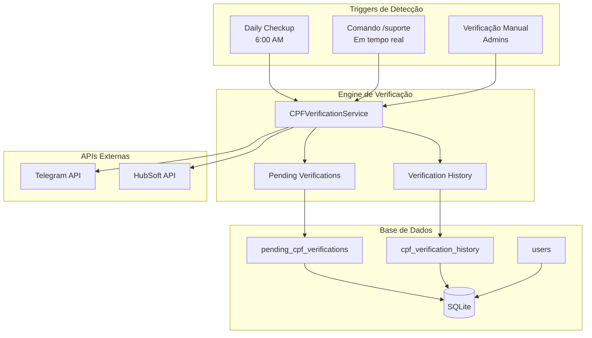

# 🔄 Sistema de Re-verificação de CPF

Documentação completa do sistema automático de re-verificação para recuperação de dados perdidos.

---

## 🎯 **VISÃO GERAL**

O sistema de re-verificação foi desenvolvido para resolver o problema crítico de perda da ligação **CPF ↔ Telegram ID** durante atualizações do bot ou mudanças no schema do banco de dados.

### 🚨 **Problema Resolvido**

Antes do sistema de re-verificação, quando ocorriam mudanças no schema do banco ou problemas durante deploys, alguns usuários perdiam seus dados de CPF associados ao Telegram ID, resultando em:

- ❌ Impossibilidade de usar `/suporte`
- ❌ Remoção incorreta durante checkups diários
- ❌ Necessidade de sair e entrar novamente no grupo
- ❌ Perda do histórico de relacionamento cliente ↔ grupo

### ✅ **Solução Implementada**

O sistema de re-verificação detecta automaticamente usuários "órfãos" (sem CPF no banco) e inicia um processo inteligente de recuperação de dados em duas situações:

1. **Daily Checkup**: Detecta membros do grupo sem CPF no banco
2. **Comando `/suporte`**: Intercepta usuários sem dados ao tentar abrir chamado

---

## 🏗️ **ARQUITETURA DO SISTEMA**

### 📊 **Diagrama de Componentes**



### 🗄️ **Schema do Banco de Dados**

```sql
-- Tabela de verificações pendentes
CREATE TABLE pending_cpf_verifications (
    id INTEGER PRIMARY KEY AUTOINCREMENT,
    user_id INTEGER UNIQUE NOT NULL,
    username TEXT,
    user_mention TEXT,
    verification_type TEXT NOT NULL,
    source_action TEXT,
    created_at TIMESTAMP DEFAULT CURRENT_TIMESTAMP,
    expires_at TIMESTAMP NOT NULL,
    attempts INTEGER DEFAULT 0,
    status TEXT DEFAULT 'pending'
);

-- Tabela de histórico de verificações
CREATE TABLE cpf_verification_history (
    id INTEGER PRIMARY KEY AUTOINCREMENT,
    user_id INTEGER NOT NULL,
    username TEXT,
    verification_type TEXT NOT NULL,
    source_action TEXT,
    success BOOLEAN NOT NULL,
    cpf TEXT,
    failure_reason TEXT,
    created_at TIMESTAMP DEFAULT CURRENT_TIMESTAMP
);
```

---

## 🔄 **FLUXOS DE EXECUÇÃO**

### 1️⃣ **Fluxo: Daily Checkup**

```
📅 Daily Checkup (6:00 AM)
├── 🔍 FASE 1: Verificação de Contratos
│   ├── Busca usuários ativos no banco
│   ├── Verifica contratos no HubSoft
│   └── Remove usuários com contrato inativo
├── 🔍 FASE 2: Detecção de Membros Órfãos
│   ├── Lista todos os membros do grupo
│   ├── Verifica CPF no banco para cada membro
│   ├── Identifica membros sem CPF
│   ├── Cria verificações pendentes (24h deadline)
│   └── Envia mensagens privadas solicitando CPF
└── 🧹 FASE 3: Limpeza
    ├── Remove verificações expiradas
    ├── Gera estatísticas completas
    └── Notifica administradores
```

**Código de exemplo:**

```python
async def find_members_without_cpf(group_members: list) -> list:
    """Identifica membros do grupo que não têm CPF no banco"""
    members_without_cpf = []

    for member in group_members:
        user_id = member['user_id']
        user_data = get_user_data(user_id)

        if not user_data or not user_data.get('cpf'):
            # Verifica se não tem verificação pendente
            pending = CPFVerificationService.get_pending_verification(user_id)
            if not pending:
                members_without_cpf.append(member)

    return members_without_cpf
```

### 2️⃣ **Fluxo: Comando `/suporte`**

```
💬 Usuario envia /suporte
├── 🔍 Verificação de Dados
│   ├── Busca dados do usuário no banco
│   └── Verifica se possui CPF válido
├── ✅ Caminho Normal (tem CPF)
│   └── Abre formulário de suporte
└── 🔄 Caminho Re-verificação (sem CPF)
    ├── Cria verificação pendente
    ├── Envia mensagem explicativa
    ├── Aguarda CPF do usuário (24h)
    └── Após verificação → Abre suporte
```

**Código de exemplo:**

```python
async def handle_support_request(update: Update, context: ContextTypes.DEFAULT_TYPE):
    """Handler para comando /suporte com re-verificação"""
    user_id = update.effective_user.id
    user_data = get_user_data(user_id)

    if not user_data or not user_data.get('cpf'):
        # Usuário sem CPF - inicia re-verificação
        await handle_missing_cpf_for_support(update, context)
        return

    # Usuário com CPF - continua fluxo normal
    await start_support_flow(update, context)
```

### 3️⃣ **Fluxo: Processamento de CPF**

```
📝 Usuario informa CPF
├── 🔍 Validação de Formato
│   ├── Verifica se tem 11 dígitos
│   ├── Remove formatação (pontos/hífens)
│   └── Valida dígitos verificadores
├── 🌐 Verificação no HubSoft
│   ├── Busca cliente por CPF
│   ├── Verifica contratos ativos
│   └── Obtém dados do cliente
├── ✅ Sucesso
│   ├── Salva CPF no banco
│   ├── Vincula ao Telegram ID
│   ├── Registra histórico
│   └── Libera acesso (suporte/grupo)
└── ❌ Falha
    ├── CPF inválido ou sem contrato
    ├── Permite nova tentativa (max 3)
    ├── Remove do grupo se esgotar tentativas
    └── Registra motivo da falha
```

**Código de exemplo:**

```python
async def process_cpf_verification(user_id: int, username: str, cpf: str) -> dict:
    """Processa verificação de CPF"""
    # 1. Validação de formato
    if not validate_cpf_format(cpf):
        return {
            'success': False,
            'message': 'CPF inválido. Use formato: 123.456.789-00'
        }

    # 2. Verificação no HubSoft
    client_data = get_client_by_cpf(cpf)
    if not client_data or not client_data.get('active_contract'):
        return {
            'success': False,
            'message': 'CPF não encontrado ou sem contrato ativo'
        }

    # 3. Salva dados
    save_user_data(user_id, cpf, client_data)
    complete_verification(user_id, True, cpf)

    return {'success': True, 'message': 'CPF verificado com sucesso!'}
```

---

## ⏱️ **GESTÃO DE PRAZOS**

### 🕐 **Deadline de 24 Horas**

Todas as verificações têm prazo de **24 horas** para conclusão:

```python
# Criação da verificação com deadline
expires_at = datetime.now() + timedelta(hours=24)

CPFVerificationService.create_pending_verification(
    user_id=user_id,
    expires_at=expires_at,
    verification_type="auto_checkup"
)
```

### ⏰ **Cleanup Automático**

```python
async def cleanup_expired_verifications():
    """Remove verificações expiradas e usuários do grupo"""
    expired = get_expired_verifications()

    for verification in expired:
        user_id = verification['user_id']

        # Remove do grupo (exceto administradores)
        if not is_user_admin(user_id):
            await remove_user_from_group(
                user_id,
                reason="Re-verificação de CPF expirada"
            )

        # Remove verificação pendente
        delete_pending_verification(user_id)

        # Registra no histórico
        log_verification_timeout(user_id)
```

---

## 📊 **MONITORAMENTO E ESTATÍSTICAS**

### 📈 **Métricas Coletadas**

```python
def get_verification_stats() -> dict:
    """Retorna estatísticas completas do sistema"""
    return {
        'pending': count_pending_verifications(),
        'expired': count_expired_verifications_today(),
        'last_24h': {
            'successful': count_successful_verifications_24h(),
            'failed': count_failed_verifications_24h()
        },
        'conversion_rate': calculate_conversion_rate(),
        'avg_response_time': calculate_avg_response_time()
    }
```

### 📊 **Dashboard de Status**

```
🔄 STATUS DO SISTEMA DE RE-VERIFICAÇÃO
=============================================
📊 Estatísticas de 26/09/2025 06:30:15

📋 VERIFICAÇÕES:
   • Pendentes: 3
   • Expiradas hoje: 1
   • Sucessos últimas 24h: 12
   • Falhas últimas 24h: 2

📈 PERFORMANCE:
   • Taxa de conversão: 85.7%
   • Tempo médio de resposta: 4.2 horas
   • Usuários recuperados: 45

⚠️ ALERTAS:
   • Nenhum alerta ativo
   • Sistema funcionando normalmente
```

---

## 🛠️ **COMANDOS E UTILITÁRIOS**

### 🎯 **Comandos para Administradores**

```bash
# Verificar status do sistema
python3 scripts/test_cpf_verification.py

# Estatísticas detalhadas
python3 -c "
from src.sentinela.services.cpf_verification_service import CPFVerificationService
stats = CPFVerificationService.get_verification_stats()
print(f'Pendentes: {stats[\"pending\"]}')
print(f'Sucessos 24h: {stats[\"last_24h\"][\"successful\"]}')
"

# Limpeza manual de verificações expiradas
python3 -c "
import asyncio
from src.sentinela.services.cpf_verification_service import CPFVerificationService
asyncio.run(CPFVerificationService.cleanup_expired_verifications())
"
```

### 🔧 **Comandos no Bot**

```
Comandos para usuários:
/start              # Verificação inicial de CPF
/suporte           # Suporte (com re-verificação se necessário)

Comandos para administradores:
/admin_reverify    # Forçar re-verificação de usuário específico
/verification_stats # Estatísticas do sistema
```

---

## 🚨 **SITUAÇÕES DE ERRO**

### ❌ **Problemas Comuns**

#### 1. **CPF Inválido**
```
Usuário: 123.456.789-00
Sistema: ❌ CPF inválido. Verifique os dígitos e tente novamente.
Solução: Permite nova tentativa (máximo 3)
```

#### 2. **Sem Contrato Ativo**
```
Usuário: 111.222.333-44 (CPF válido)
HubSoft: Cliente sem contrato ativo
Sistema: ❌ CPF válido mas sem contrato ativo na OnCabo
Solução: Orienta usuário a regularizar situação
```

#### 3. **Timeout de 24h**
```
Verificação criada: 25/09/2025 08:00
Deadline: 26/09/2025 08:00
Status: ⏰ Prazo expirado
Ação: Remove automaticamente do grupo
```

#### 4. **API HubSoft Offline**
```
Erro: Timeout na conexão com HubSoft
Sistema: Aguarda retry automático (3 tentativas)
Fallback: Mantém usuário no grupo até sistema voltar
```

### 🔧 **Troubleshooting**

```bash
# Verificar logs de re-verificação
tail -f logs/cpf_verification.log

# Verificar verificações pendentes
sqlite3 data/database/sentinela.db "
SELECT user_id, username, verification_type, expires_at, status
FROM pending_cpf_verifications;
"

# Verificar histórico de falhas
sqlite3 data/database/sentinela.db "
SELECT user_id, verification_type, failure_reason, created_at
FROM cpf_verification_history
WHERE success = 0
ORDER BY created_at DESC LIMIT 10;
"
```

---

## 🎯 **CONFIGURAÇÃO E DEPLOY**

### ⚙️ **Variáveis de Configuração**

```bash
# .env - Configurações específicas do sistema
CPF_VERIFICATION_TIMEOUT_HOURS=24     # Prazo para verificação
MAX_VERIFICATION_ATTEMPTS=3           # Máximo de tentativas
AUTO_CLEANUP_ENABLED=true            # Limpeza automática
VERIFICATION_RETRY_INTERVAL=300      # Intervalo entre tentativas (segundos)
```

### 🚀 **Deploy com Re-verificação**

```bash
# 1. Deploy normal
git pull && ./deployment/deploy.sh

# 2. Verificação pós-deploy
python3 scripts/test_cpf_verification.py

# 3. Monitoramento inicial
docker logs -f oncabito-bot | grep "re-verification"

# 4. Teste manual (opcional)
# Criar usuário de teste sem CPF e verificar fluxo
```

---

## 📚 **REFERÊNCIAS TÉCNICAS**

### 📁 **Arquivos Principais**

```
src/sentinela/services/cpf_verification_service.py
├── create_pending_verification()          # Cria verificação
├── process_cpf_verification()             # Processa CPF
├── cleanup_expired_verifications()        # Limpeza automática
├── get_verification_stats()               # Estatísticas
└── send_cpf_verification_request()        # Envia solicitação

scripts/daily_checkup.py
├── find_members_without_cpf()             # Detecta órfãos
├── process_members_without_cpf()          # Processa órfãos
└── run_daily_checkup()                    # Checkup completo

src/sentinela/bot/handlers.py
├── handle_cpf_verification_response()     # Resposta do usuário
├── handle_cpf_verification_cancel()       # Cancelamento
└── handle_support_request()               # /suporte com verificação
```

### 🧪 **Testes Automatizados**

```bash
# Script de teste completo
scripts/test_cpf_verification.py

Testes incluem:
✅ Estrutura do banco de dados
✅ Criação de verificações
✅ Processamento de CPF
✅ Limpeza de expiradas
✅ Estatísticas
✅ Integração com APIs
```

---

*Documentação do Sistema de Re-verificação criada em 26/09/2025 - OnCabito Gaming Bot v2.2*

### 🎉 **Benefícios Alcançados**

- ✅ **Zero Perda de Dados**: Recuperação automática de usuários órfãos
- ✅ **Experiência Contínua**: Usuários não precisam sair e entrar no grupo
- ✅ **Monitoramento 24/7**: Detecção e correção automática
- ✅ **Segurança**: Apenas CPFs com contratos ativos são aceitos
- ✅ **Transparência**: Histórico completo de todas as verificações
- ✅ **Reliability**: Sistema à prova de falhas com múltiplos fallbacks