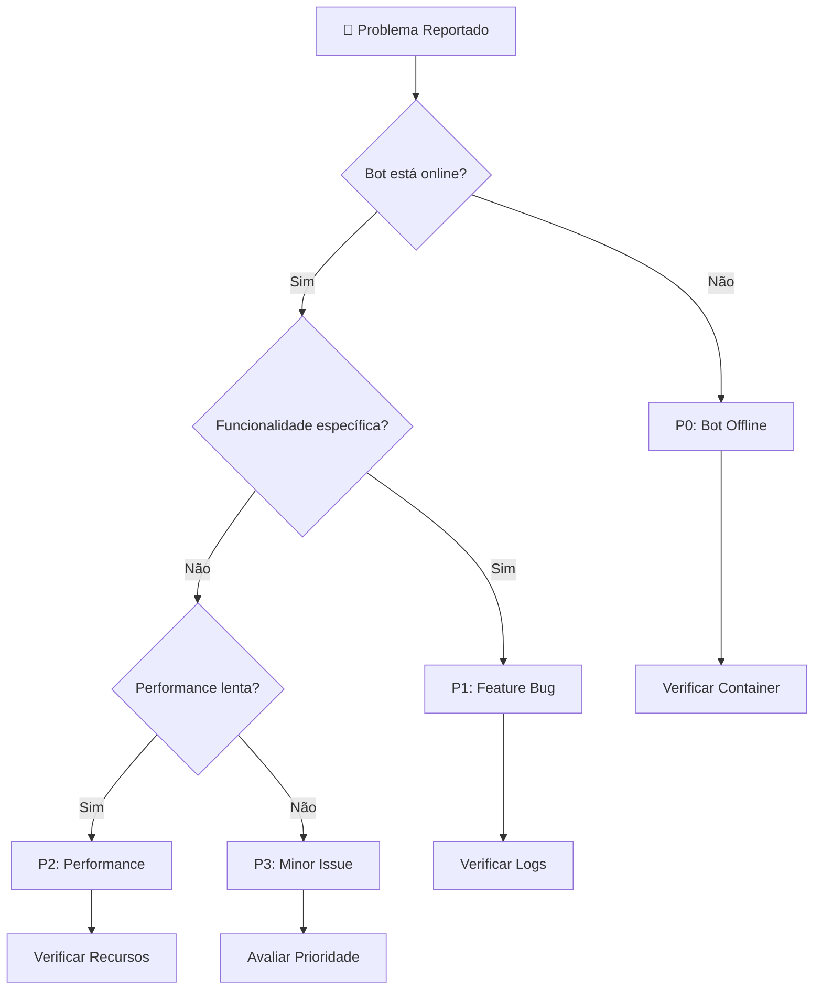

# 🔧 Troubleshooting Completo - OnCabito Bot

Guia definitivo para resolução de problemas em todos os níveis do sistema.

---

## 🚨 **MATRIZ DE PROBLEMAS**

### 📊 **Classificação por Severidade**

| Nível | Descrição | Tempo de Resolução | Impacto |
|-------|-----------|-------------------|---------|
| 🔴 **P0** | Bot offline/não responde | < 5 minutos | Crítico |
| 🟡 **P1** | Funcionalidade quebrada | < 30 minutos | Alto |
| 🟢 **P2** | Performance degradada | < 2 horas | Médio |
| 🔵 **P3** | Melhorias/bugs menores | < 24 horas | Baixo |

### 🎯 **Fluxo de Diagnóstico**



---

## 🔴 **P0: PROBLEMAS CRÍTICOS**

### 🤖 **Bot Offline/Não Responde**

#### 🔍 **Diagnóstico Rápido (2 minutos):**

```bash
# 1. Status do container
docker-compose ps

# 2. Logs recentes
docker-compose logs --tail 50 oncabito-bot

# 3. Recursos do sistema
df -h && free -h

# 4. Conectividade
ping google.com
```

#### 🛠️ **Soluções por Sintoma:**

**Container não está rodando:**
```bash
# Status: Exited
docker-compose down
docker-compose up -d

# Se falhar:
docker-compose logs oncabito-bot
```

**Container rodando mas unhealthy:**
```bash
# Verificar health check
docker inspect oncabito-bot | grep Health -A 20

# Restart forçado
docker-compose restart oncabito-bot
```

**Erro de configuração:**
```bash
# Verificar .env
cat /opt/oncabito-bot/.env | grep -v PASSWORD

# Recarregar configuração
docker-compose down
docker-compose up -d
```

**Sem espaço em disco:**
```bash
# Limpar Docker
docker system prune -f

# Limpar logs antigos
find /opt/oncabito-bot/logs -name "*.log" -mtime +7 -delete

# Se ainda houver problema
du -sh /opt/oncabito-bot/*
```

### 🌐 **Erro de Conectividade**

#### 🔍 **Teste de APIs:**

```bash
# Telegram API
curl -s "https://api.telegram.org/bot${TELEGRAM_TOKEN}/getMe"

# HubSoft API
curl -s "${HUBSOFT_HOST}/health" || echo "API não responde"

# DNS resolution
nslookup api.telegram.org
nslookup api.oncabo.hubsoft.com.br
```

#### 🛠️ **Soluções:**

**Firewall bloqueando:**
```bash
# Ubuntu/Debian
sudo ufw status
sudo ufw allow out 443
sudo ufw allow out 80

# CentOS/RHEL
sudo firewall-cmd --list-all
sudo firewall-cmd --add-port=443/tcp --permanent
```

**Proxy/Corporate network:**
```bash
# Adicionar ao docker-compose.yml
environment:
  - HTTP_PROXY=http://proxy:8080
  - HTTPS_PROXY=http://proxy:8080
  - NO_PROXY=localhost,127.0.0.1
```

**Rate limiting:**
```bash
# Verificar logs por rate limit
docker-compose logs oncabito-bot | grep -i "rate\|limit\|429"

# Implementar backoff (já implementado no código)
```

---

## 🟡 **P1: PROBLEMAS DE FUNCIONALIDADE**

### 👤 **Verificação de Usuário Falhando**

#### 🔍 **Diagnóstico:**

```bash
# Logs específicos de verificação
docker-compose logs oncabito-bot | grep -i "verificação\|cpf\|hubsoft"

# Teste manual da API
curl -X POST "${HUBSOFT_HOST}/oauth/token" \
  -d "client_id=${HUBSOFT_CLIENT_ID}" \
  -d "client_secret=${HUBSOFT_CLIENT_SECRET}" \
  -d "username=${HUBSOFT_USER}" \
  -d "password=${HUBSOFT_PASSWORD}" \
  -d "grant_type=password"
```

#### 🛠️ **Soluções:**

**Credenciais inválidas:**
```bash
# Verificar .env
nano /opt/oncabito-bot/.env

# Testar credenciais manualmente
python3 -c "
import sys
sys.path.append('/opt/oncabito-bot/src')
from sentinela.clients.erp_client import ERPClient
client = ERPClient()
print(client.authenticate())
"
```

**Formato de resposta mudou:**
```bash
# Debug da resposta da API
docker-compose exec oncabito-bot python3 -c "
import requests
# Fazer request e analisar response
"
```

**CPF não encontrado:**
```bash
# Verificar se CPF está correto
# Testar com CPF conhecido ativo
docker-compose logs oncabito-bot | grep "CPF.*não encontrado"
```

### 🔗 **Links de Convite Falhando**

#### 🔍 **Diagnóstico:**

```bash
# Verificar permissões do bot no grupo
docker-compose logs oncabito-bot | grep -i "invite\|link\|permission"

# Verificar configuração de grupo
echo "TELEGRAM_GROUP_ID: ${TELEGRAM_GROUP_ID}"
```

#### 🛠️ **Soluções:**

**Bot sem permissão:**
1. Telegram → Grupo → Configurações → Administradores
2. Adicionar bot como admin com permissão "Convidar usuários"

**ID do grupo incorreto:**
```bash
# Descobrir ID correto
docker-compose exec oncabito-bot python3 -c "
import sys
sys.path.append('/opt/oncabito-bot/src')
from sentinela.services.topic_discovery import discover_topics
print(discover_topics())
"
```

### 📝 **Tópicos Não Funcionando**

#### 🔍 **Diagnóstico:**

```bash
# Verificar IDs dos tópicos
grep "TOPIC_ID" /opt/oncabito-bot/.env

# Logs de mensagens em tópicos
docker-compose logs oncabito-bot | grep -i "topic\|thread"
```

#### 🛠️ **Soluções:**

**IDs incorretos:**
```bash
# Redescobrir tópicos
docker-compose exec oncabito-bot python3 scripts/discover_topics.py

# Atualizar .env com IDs corretos
nano /opt/oncabito-bot/.env

# Reiniciar bot
docker-compose restart oncabito-bot
```

---

## 🟢 **P2: PROBLEMAS DE PERFORMANCE**

### 🐌 **Bot Respondendo Lentamente**

#### 🔍 **Diagnóstico:**

```bash
# Recursos do container
docker stats oncabito-bot --no-stream

# Recursos do host
top -p $(docker inspect -f '{{.State.Pid}}' oncabito-bot)

# Logs de performance
docker-compose logs oncabito-bot | grep -i "timeout\|slow\|delay"
```

#### 🛠️ **Métricas de Performance:**

```bash
# Tempo de resposta das APIs
curl -w "@curl-format.txt" -s "https://api.telegram.org/bot${TELEGRAM_TOKEN}/getMe"

# Onde curl-format.txt contém:
echo "time_total: %{time_total}s\ntime_connect: %{time_connect}s\ntime_starttransfer: %{time_starttransfer}s\n" > curl-format.txt
```

#### 🛠️ **Soluções:**

**Falta de recursos:**
```yaml
# docker-compose.yml - aumentar limits
deploy:
  resources:
    limits:
      memory: 1G
      cpus: '1.0'
```

**Banco de dados lento:**
```bash
# Analisar tamanho do banco
ls -lh /opt/oncabito-bot/data/database/

# Otimizar SQLite
docker-compose exec oncabito-bot python3 -c "
import sqlite3
conn = sqlite3.connect('/app/data/database/sentinela.db')
conn.execute('VACUUM')
conn.execute('ANALYZE')
conn.close()
"
```

**APIs externas lentas:**
```bash
# Implementar cache (se necessário)
# Configurar timeouts mais baixos
# Implementar circuit breaker
```

### 💾 **Alto Uso de Memória**

#### 🔍 **Diagnóstico:**

```bash
# Uso de memória detalhado
docker exec oncabito-bot ps aux

# Memory leaks
docker exec oncabito-bot python3 -c "
import psutil
import os
process = psutil.Process(os.getpid())
print(f'Memory: {process.memory_info().rss / 1024 / 1024:.2f} MB')
"
```

#### 🛠️ **Soluções:**

**Memory leaks:**
```bash
# Restart periódico (se necessário)
echo "0 6 * * * cd /opt/oncabito-bot && docker-compose restart oncabito-bot" | crontab -
```

**Otimização de código:**
- Verificar loops infinitos
- Limpar conexões não utilizadas
- Implementar garbage collection manual

---

## 🔵 **P3: PROBLEMAS MENORES**

### 📊 **Logs Muito Verbosos**

#### 🛠️ **Configuração de Log Level:**

```python
# src/sentinela/core/config.py
import logging

LOG_LEVEL = os.getenv('LOG_LEVEL', 'INFO')
logging.basicConfig(level=getattr(logging, LOG_LEVEL))
```

### 🕐 **Timezone Incorreto**

#### 🛠️ **Corrigir Fuso Horário:**

```yaml
# docker-compose.yml
environment:
  - TZ=America/Sao_Paulo
```

---

## 🚀 **TROUBLESHOOTING DO CI/CD**

### ❌ **GitHub Actions Falhando**

#### 🔍 **Build Failures:**

```yaml
# Erro comum: Dependencies
- name: Debug Dependencies
  run: |
    pip list
    pip check
    python -c "import telegram; print('OK')"
```

#### 🔍 **Deploy Failures:**

```bash
# SSH connection issues
ssh -v user@server # Debug connection

# Registry authentication
docker login ghcr.io -u username

# Permission issues
ls -la /opt/oncabito-bot/
sudo chown -R user:user /opt/oncabito-bot/
```

### 🔄 **Deploy Não Atualiza**

#### 🔍 **Diagnóstico:**

```bash
# Verificar se imagem foi atualizada
docker images | grep oncabito-bot

# Verificar timestamp
docker inspect ghcr.io/gustsr/oncabito-gaming-bot:latest | grep Created

# Forçar pull
docker pull ghcr.io/gustsr/oncabito-gaming-bot:latest --no-cache
```

---

## 🛠️ **FERRAMENTAS DE DIAGNÓSTICO**

### 📋 **Script de Health Check Completo**

```bash
#!/bin/bash
# health_check.sh

echo "🔍 OnCabito Bot - Health Check Completo"
echo "======================================"

# Container status
echo "📦 Container Status:"
docker-compose ps

# Resource usage
echo "💻 Resource Usage:"
docker stats oncabito-bot --no-stream

# Disk space
echo "💾 Disk Space:"
df -h /opt/oncabito-bot

# API connectivity
echo "🌐 API Connectivity:"
timeout 5 curl -s https://api.telegram.org/bot${TELEGRAM_TOKEN}/getMe > /dev/null && echo "✅ Telegram OK" || echo "❌ Telegram FAIL"

# Database
echo "🗄️ Database:"
ls -lh /opt/oncabito-bot/data/database/

# Recent logs
echo "📋 Recent Logs (last 10 lines):"
docker-compose logs --tail 10 oncabito-bot

echo "✅ Health check completed"
```

### 🔍 **Script de Debug Avançado**

```bash
#!/bin/bash
# debug.sh

echo "🐛 OnCabito Bot - Debug Avançado"
echo "================================"

# System info
echo "🖥️ System Info:"
uname -a
docker --version
docker-compose --version

# Network
echo "🌐 Network:"
netstat -tuln | grep LISTEN
ss -tuln

# Environment
echo "⚙️ Environment:"
docker-compose exec oncabito-bot env | grep -v PASSWORD | sort

# Process tree
echo "🌳 Process Tree:"
docker-compose exec oncabito-bot ps auxf

# Python modules
echo "🐍 Python Modules:"
docker-compose exec oncabito-bot pip list

# Configuration test
echo "🔧 Configuration Test:"
docker-compose exec oncabito-bot python3 -c "
import sys
sys.path.append('/app/src')
try:
    from sentinela.core.config import *
    print('✅ Configuration loaded successfully')
    print(f'Database: {DATABASE_FILE}')
    print(f'Group ID: {TELEGRAM_GROUP_ID}')
except Exception as e:
    print(f'❌ Configuration error: {e}')
"

echo "🐛 Debug completed"
```

### 📊 **Monitoramento Contínuo**

```bash
#!/bin/bash
# monitor.sh

while true; do
    clear
    echo "🔄 OnCabito Bot - Monitor ($(date))"
    echo "=================================="

    # Quick status
    docker-compose ps

    # Resource usage
    docker stats oncabito-bot --no-stream

    # Recent errors
    echo "🚨 Recent Errors:"
    docker-compose logs --since 1h oncabito-bot | grep -i error | tail -5

    sleep 30
done
```

---

## 📞 **ESCALATION E SUPORTE**

### 🆘 **Quando Escalar**

**Escalar imediatamente se:**
- ✅ Bot offline > 5 minutos
- ✅ Múltiplos usuários reportando problemas
- ✅ Erro de segurança/dados expostos
- ✅ APIs externas indisponíveis

### 📋 **Informações para Suporte**

```bash
# Coletar informações essenciais
echo "System: $(uname -a)" > support_info.txt
echo "Docker: $(docker --version)" >> support_info.txt
echo "Compose: $(docker-compose --version)" >> support_info.txt
echo "Container Status:" >> support_info.txt
docker-compose ps >> support_info.txt
echo "Recent Logs:" >> support_info.txt
docker-compose logs --tail 50 oncabito-bot >> support_info.txt
echo "Environment (sanitized):" >> support_info.txt
docker-compose exec oncabito-bot env | grep -v PASSWORD | sort >> support_info.txt
```

### 🔄 **Procedimento de Rollback**

```bash
#!/bin/bash
# rollback.sh

echo "🔄 Iniciando rollback do OnCabito Bot..."

# Listar versões disponíveis
echo "📦 Versões disponíveis:"
docker images | grep oncabito-bot

read -p "Digite a tag para rollback (ex: main-abc123): " ROLLBACK_TAG

if [ -z "$ROLLBACK_TAG" ]; then
    echo "❌ Tag não fornecida"
    exit 1
fi

# Fazer rollback
echo "🔄 Fazendo rollback para $ROLLBACK_TAG..."
docker pull ghcr.io/gustsr/oncabito-gaming-bot:$ROLLBACK_TAG
docker tag ghcr.io/gustsr/oncabito-gaming-bot:$ROLLBACK_TAG ghcr.io/gustsr/oncabito-gaming-bot:latest
docker-compose down
docker-compose up -d

# Verificar
sleep 10
docker-compose ps
echo "✅ Rollback concluído"
```

---

## 📈 **PREVENÇÃO DE PROBLEMAS**

### ⏰ **Manutenção Preventiva**

```bash
# Cron job para manutenção semanal
0 3 * * 0 /opt/oncabito-bot/maintenance.sh

# maintenance.sh
#!/bin/bash
echo "🔧 Manutenção preventiva semanal"

# Backup
./backup.sh

# Limpar Docker
docker system prune -f

# Otimizar banco
docker-compose exec oncabito-bot python3 -c "
import sqlite3
conn = sqlite3.connect('/app/data/database/sentinela.db')
conn.execute('VACUUM')
conn.close()
"

# Restart
docker-compose restart oncabito-bot

echo "✅ Manutenção concluída"
```

### 📊 **Alertas Automáticos**

```bash
# check_bot.sh - Monitor automático
#!/bin/bash

WEBHOOK_URL="https://api.telegram.org/bot${ALERT_BOT_TOKEN}/sendMessage"
CHAT_ID="${ADMIN_CHAT_ID}"

if ! docker-compose ps | grep oncabito-bot | grep "Up"; then
    curl -s -X POST "$WEBHOOK_URL" \
        -d "chat_id=$CHAT_ID" \
        -d "text=🚨 OnCabito Bot está offline! Verificar servidor."
fi

# Executar a cada 5 minutos
*/5 * * * * /opt/oncabito-bot/check_bot.sh
```

---

*Guia de troubleshooting criado em 23/09/2025 - OnCabito Gaming Bot v2.0*